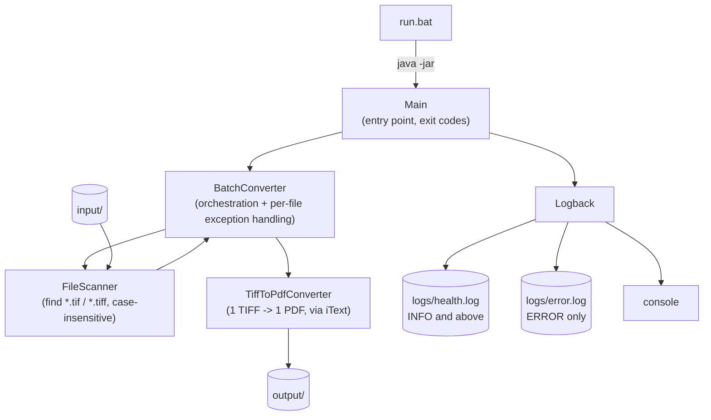
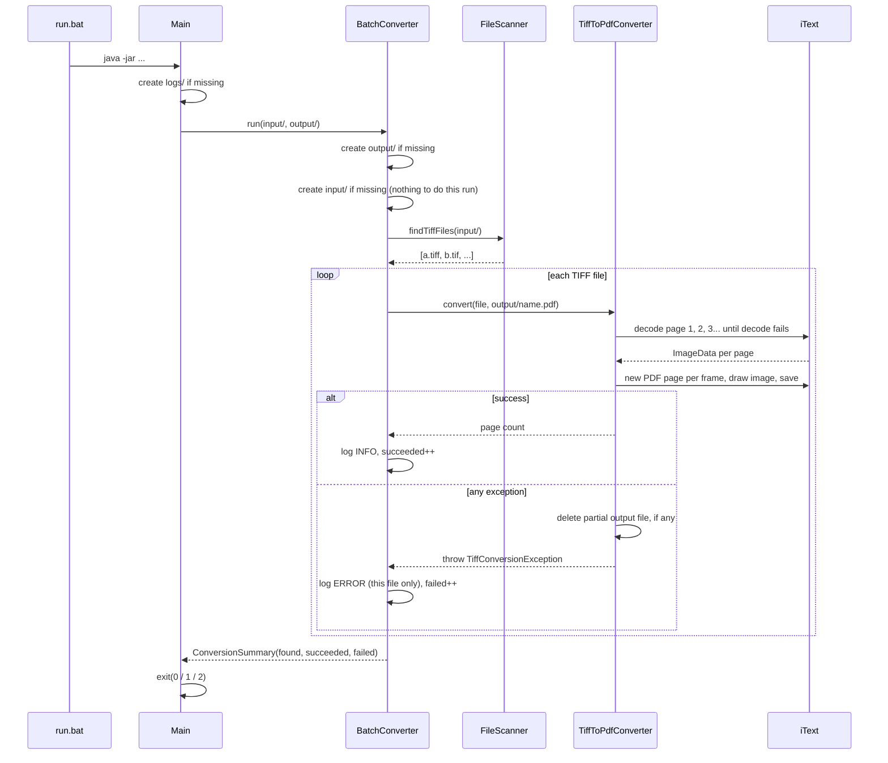

# Architecture

A single-process, single-JVM batch job. No server, no database, no network calls
at runtime — it reads files, writes files, writes logs, exits.

## Component diagram

## Flow: one batch run

## Why these choices

- **No page-count API in iText's TIFF decoder** — `ImageDataFactory.createTiff`
  decodes one page at a time and throws once you ask for a page past the end.
  `TiffToPdfConverter.countPages` uses that directly: decode page 1 (must
  succeed, or the file isn't a readable TIFF at all), then keep asking for the
  next page until it throws. No dependency on an internal/undocumented API for
  frame counting.
- **`kernel` + `io` only, not `layout`** — PDF pages are built directly with
  `PdfCanvas.addImageFittedIntoRectangle` against a `PageSize` matched to the
  image's pixel dimensions. This is more code than `layout`'s auto-flowing
  `Document.add(image)`, but it guarantees exactly one image per page with no
  layout-engine surprises, and drops a whole dependency.
- **Exceptions caught per-file, not per-batch** — `BatchConverter.run` wraps each
  file's `converter.convert(...)` call individually. A corrupt file throws
  `TiffConversionException`, which is caught, logged, and counted as a failure;
  the loop continues to the next file. Nothing above that layer needs to know a
  single file failed.
- **Partial output is always deleted on failure** — if a PDF write fails midway
  (e.g. page 2 of 3 decodes fine but page 3 is corrupt), `TiffToPdfConverter`
  deletes whatever was written before rethrowing, so `output/` never contains a
  broken half-written PDF.
- **Two log files via Logback filters, not two loggers** — `error.log` uses a
  `LevelFilter` (`ERROR` only), `health.log` uses a `ThresholdFilter` (`INFO`
  and above, i.e. everything meaningful). One `Logger` call site (`log.error(...)`,
  `log.info(...)`) fans out to whichever files match, configured entirely in
  `logback.xml` — no manual routing logic in application code.
- **Exit codes carry meaning (0/1/2)** — makes the batch usable from a scheduled
  task or another script later without needing to parse log output to know
  whether anything failed.

## Test fixtures are real files, not mocks

`TiffFixtureGenerator` (test scope) uses the TwelveMonkeys ImageIO TIFF plugin to
render actual valid single- and multi-page TIFFs, plus a deliberately-corrupt file.
Tests exercise the real `TiffToPdfConverter`/iText code path end-to-end — reading
real TIFF bytes, writing a real PDF, then reading that PDF back with iText to
assert its page count — rather than mocking the conversion logic itself. The same
generator populates the checked-in `input/` sample files, so the manual `run.bat`
experience and the automated tests describe identical scenarios.
