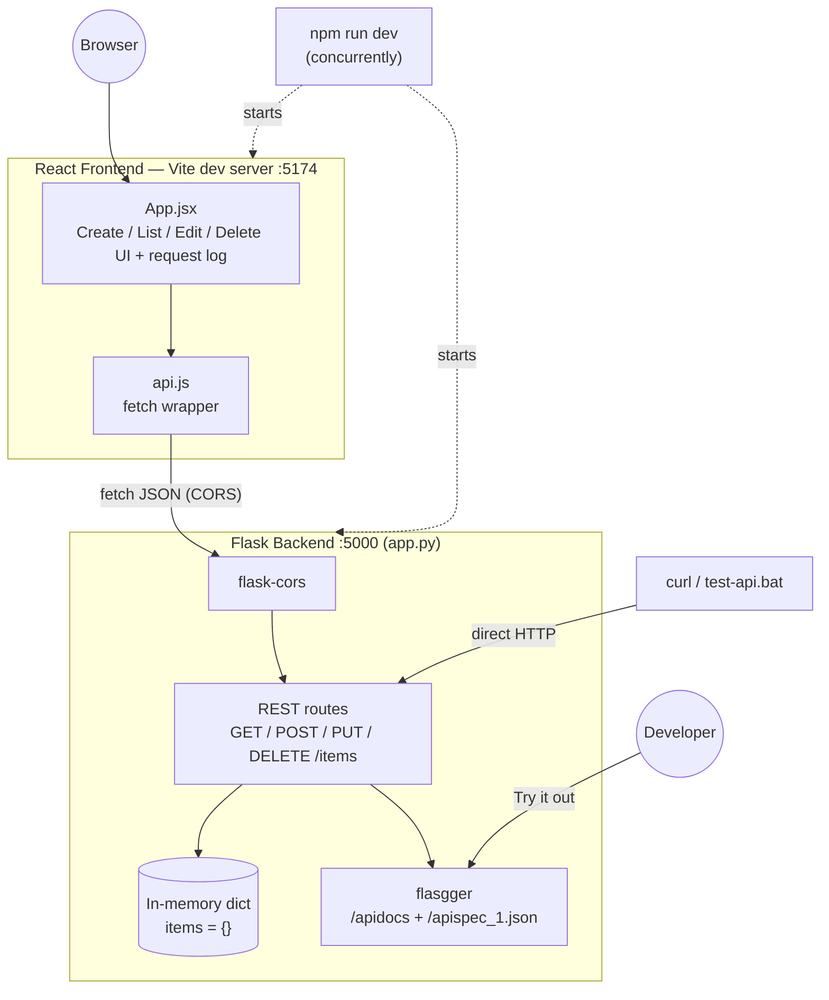
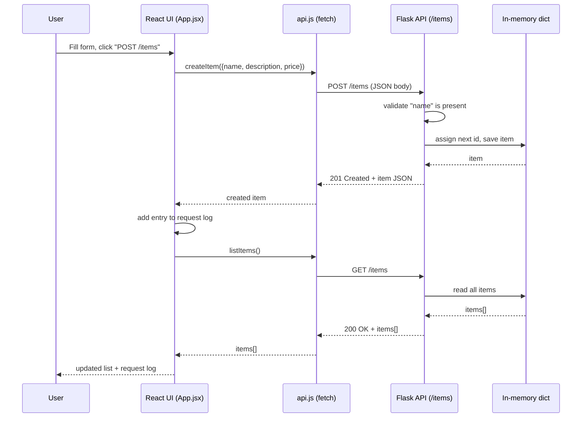

# Architecture

`python-web-demo` is two small processes running side by side on your machine: a
Flask REST API holding data in memory, and a React UI that talks to it over HTTP.
There's no database, no auth, and no build/deploy pipeline — it's intentionally
minimal so the CRUD flow and the API/UI boundary stay easy to follow.

## Component diagram

### Pieces

| Component | What it is | Where |
|---|---|---|
| **`npm run dev`** | Root script (`concurrently`) that starts both servers with one command and labels their output `[backend]` / `[frontend]`. | [`package.json`](package.json) |
| **React Frontend** | Vite dev server on port `5174`. `App.jsx` holds all UI state (items, form, edit mode, request log); `api.js` is a thin `fetch` wrapper around the four CRUD calls. | [`frontend/src/`](frontend/src) |
| **Flask Backend** | Single-file API on port `5000`. Routes read/write an in-memory Python `dict` — no database, so data resets whenever the process restarts. | [`app.py`](app.py) |
| **flask-cors** | Lets the frontend (a different origin: `:5174` vs `:5000`) call the API directly from the browser without CORS errors. | `app.py` |
| **flasgger** | Generates an OpenAPI spec from docstrings on each route and serves an interactive Swagger UI. | `app.py`, `/apidocs` |
| **In-memory store** | A plain `dict` keyed by item id, seeded with 3 sample items on startup. This *is* the database for this demo. | `app.py` |
| **curl / `test-api.bat`** | Alternate clients that hit the API directly, bypassing the React UI entirely — useful for scripted testing. | [`test-api.bat`](test-api.bat) |

## Request flow: creating an item

The sequence below shows what happens end-to-end when a user submits the "Create
item" form in the React UI. Every mutation (create/update/delete) in the UI follows
this same pattern: perform the action, then re-fetch the full list so the UI always
reflects the backend's current state.

If the backend returns an error (e.g. `400` for a missing `name`, `404` for an
unknown id), `api.js` throws and `App.jsx` shows it in the red alert banner and logs
the failure in the request log — no silent failures.

## Why these choices

- **In-memory storage instead of a database** — keeps the demo runnable with zero
  setup (no Postgres/SQLite/migrations). The tradeoff is that state doesn't survive
  a restart, which is fine for a demo/testing app.
- **Separate frontend/backend processes instead of Flask serving the built UI** —
  keeps the API independently testable (curl, Swagger, `test-api.bat`) and lets the
  frontend use Vite's dev server (fast HMR) instead of a production build during
  development.
- **`concurrently` instead of two manual terminals** — one command (`npm run dev`)
  to get a working full-stack environment; the two-terminal steps are kept in the
  README as a fallback for anyone who wants the processes separated.
