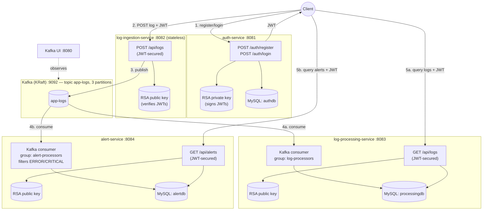
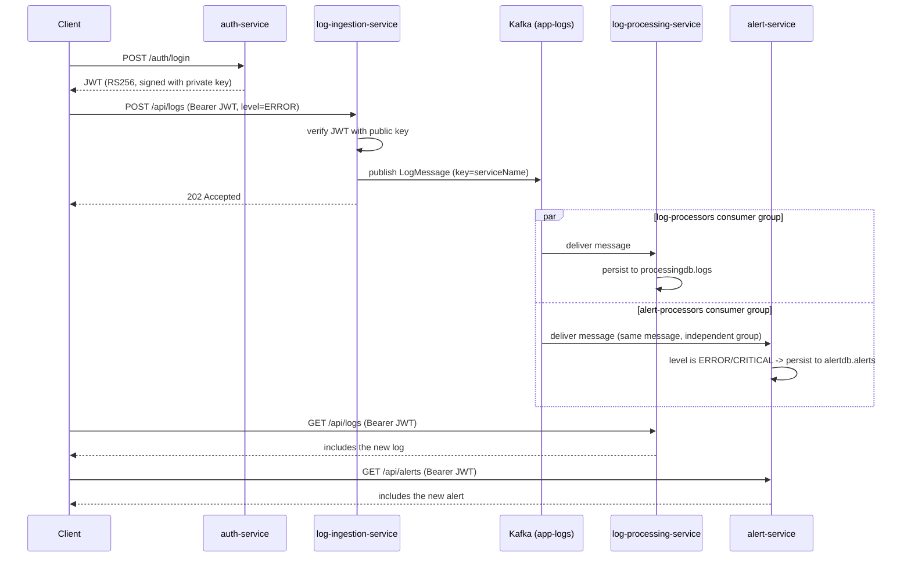

# Architecture

`log-monitor` is 4 independent Spring Boot services connected through Kafka, backed
by MySQL, secured with RS256 JWTs, and documented with Swagger/OpenAPI on every
service. Nothing calls another service directly over HTTP except `auth-service`
issuing the token the client then presents everywhere else — all inter-service data
flow happens through the `app-logs` Kafka topic.

## Component diagram

Every service that verifies JWTs (ingestion, processing, alert) carries only the
**public** key — only `auth-service` has the private key. That split is the whole
reason `auth-service` is a separate service rather than login logic bolted onto
ingestion: it isolates the one secret that can forge tokens.

## Request flow: publish a log, see it in two places

The two consumers are **separate consumer groups reading the same topic** — Kafka
delivers every message to both independently. Neither knows the other exists.

## Load / scalability

Verified locally: `load-test.ps1` sending 200 `POST /api/logs` at concurrency 20
completed in ~4.6s (~44 req/s, 0 failures), and Kafka UI showed both consumer
groups back at 0 lag within a few seconds — on a single-broker, single-instance-
per-service setup with no tuning. That's the baseline this section explains and
extends.

- **`log-ingestion-service` and `auth-service` are the easiest to scale.** Ingestion
  holds no state at all (JWT verification is a pure function of the public key) and
  auth only touches lightweight user-lookup queries — both can run N replicas behind
  a load balancer with zero coordination.
- **Kafka partitioning caps consumer parallelism.** `app-logs` has 3 partitions, so
  each consumer group (`log-processors`, `alert-processors`) can usefully run up to
  3 instances — a 4th instance in the same group would sit idle with no partitions
  to claim. The two groups scale **independently** of each other since they're
  separate groups on the same topic.
- **MySQL is the likely bottleneck at real volume**, specifically the per-message
  insert in `log-processing-service` (every single log gets a row; `alert-service`
  only writes ERROR/CRITICAL, so it sees a fraction of the traffic). Mitigations,
  in order of effort: (1) switch the Kafka listener to batch mode and do a single
  JDBC batch insert per poll instead of one insert per message; (2) beyond this
  demo, move the `logs` table specifically to a store built for log volume
  (Elasticsearch, ClickHouse) while keeping MySQL for `alerts`/`users`, which stay
  small.
- **Kafka itself runs single-broker, replication factor 1** here — a demo
  simplification with zero fault tolerance. Production would run ≥3 brokers with
  RF=3, and would size partition count for target consumer parallelism up front
  (repartitioning later means keys can route differently, which some designs can't
  tolerate).
- **Consumer lag is the signal to watch**, not raw request latency — Kafka UI's
  consumer-groups view shows it directly. Rising lag under sustained load means "add
  more consumer instances" (up to the partition count) or "increase partitions."
  This is exactly what `load-test.ps1` + Kafka UI let you observe live.
- **Path to production autoscaling**: this Compose topology is a direct map onto
  Kubernetes — each service becomes a Deployment, and consumer-lag-driven
  autoscaling (e.g. KEDA's Kafka scaler) replaces manually running
  `docker compose up --scale log-processing-service=2`.

## Demo simplifications (called out explicitly)

- One MySQL instance hosting 3 logical databases, instead of one instance per
  service.
- RSA keypair checked into the repo for convenience — never do this for a real
  deployment; use a secrets manager and rotate keys.
- Kafka runs as a single broker with RF=1.
- No refresh tokens / token revocation — JWTs are valid for their full
  `jwt.expiration-seconds` window (default 1 hour) with no way to invalidate one
  early.
